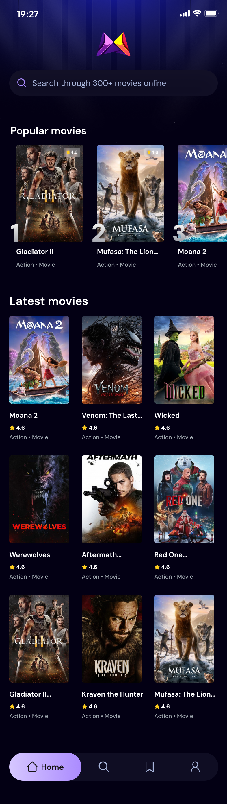

# 🎬 Welcome to Your Movie App!



This is a **React Native** project built with [Expo](https://expo.dev), designed to provide an immersive movie browsing experience. 

## 🚀 Get Started

### 1️⃣ Install Dependencies

Run the following command to install project dependencies:

```bash
npm install
```

### 2️⃣ Start the App

To run the app in development mode, execute:

```bash
npx expo start
```

You'll have the option to open the app using:
- [Development build](https://docs.expo.dev/develop/development-builds/introduction/)
- [Android emulator](https://docs.expo.dev/workflow/android-studio-emulator/)
- [iOS simulator](https://docs.expo.dev/workflow/ios-simulator/)
- [Expo Go](https://expo.dev/go) for quick testing

## 📂 Project Structure

This project follows a **file-based routing** system. You can start developing by modifying files inside the **app/** directory.

```
/movie-app
│── app/
│   ├── screens/
│   │   ├── HomeScreen.js
│   │   ├── MovieDetailsScreen.js
│   ├── components/
│   │   ├── MovieCard.js
│   │   ├── Header.js
│   ├── hooks/
│   ├── assets/
│── package.json
│── README.md
```

## 🔄 Reset Project

If you need a fresh start, run:

```bash
npm run reset-project
```

This will move your starter code to the **app-example/** directory and create a blank **app/** directory.

## 📖 Learn More

To dive deeper into Expo and React Native, check out these resources:

- [Expo Documentation](https://docs.expo.dev/)
- [React Native Docs](https://reactnative.dev/docs/getting-started)
- [File-based Routing Guide](https://docs.expo.dev/router/introduction/)

## 🌍 Join the Community

Be part of the growing Expo and React Native community:

- [Expo on GitHub](https://github.com/expo/expo)
- [Expo Discord](https://chat.expo.dev)

Happy coding! 🎥🍿
